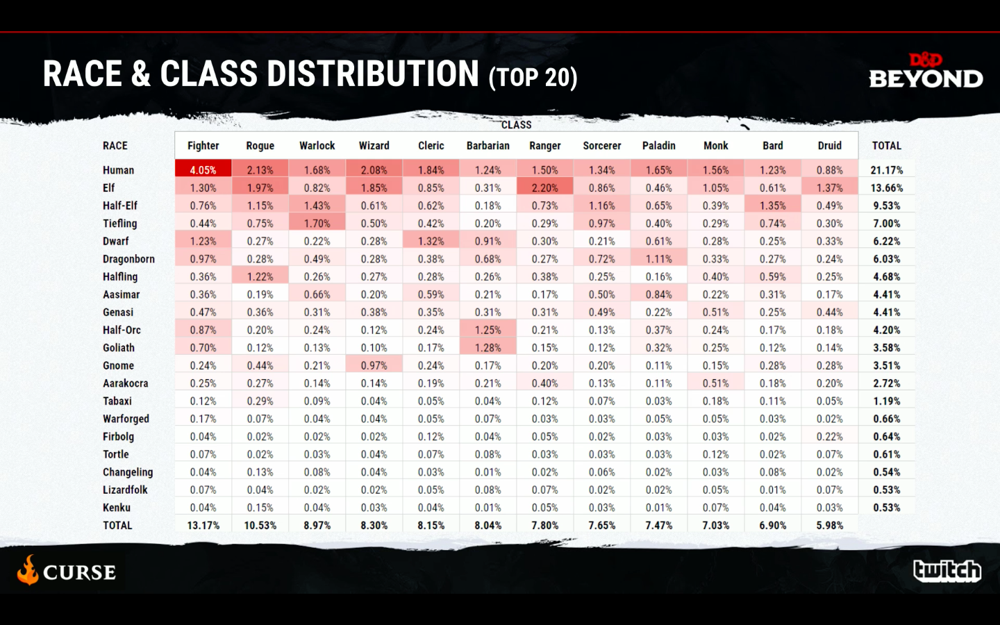
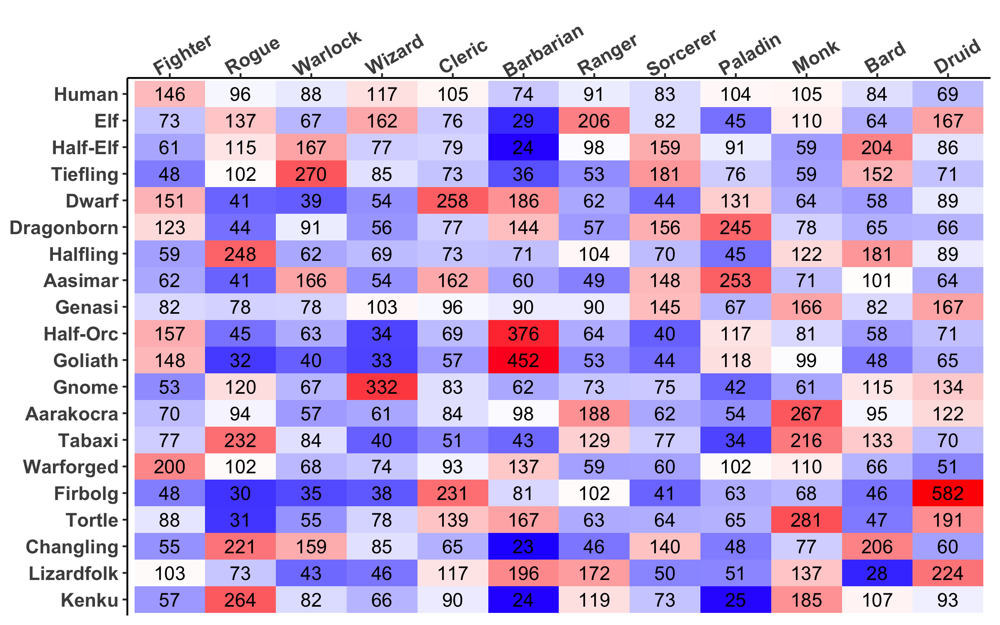

# DDBCharacters
A look at character data from D&amp;D Beyond

During a development update video on August 29th 2018 the following graphic was shown. It shows the popularity of the race and class combinations for the 20 most popular races.
\n

\n
I wanted to use this data and see which combinations appeared more or less often than expected based on the popularity of its component race and class. To do this I calculated what the mathematically expected popularity of each combination would be by multiplying the popularity of the component race and class. For example, if 20% of all characters were human, and 10% of all characters were fighters, you would mathematically expect 20% * 10% = 2% of all characters to be human fighters. I then compared the observed popularity to the expected popularity and expressed it as a percent of expected. This was the result:

\n

\n
The highest and lowest scoring combinations were:

Table: 5 Highest Combinations

|   |Race      |Class     | Percent|
|--:|:---------|:---------|-------:|
|  1|Firbolg   |Druid     |     582|
|  2|Goliath   |Barbarian |     452|
|  3|Half-Orc  |Barbarian |     376|
|  4|Gnome     |Wizard    |     332|
|  5|Tortle    |Monk      |     281|
|  6|Tiefling  |Warlock   |     270|
|  7|Aarakocra |Monk      |     267|
|  8|Kenku     |Rogue     |     264|
|  9|Dwarf     |Cleric    |     258|
| 10|Aasimar   |Paladin   |     253|

Table: 5 Lowest Combinations

|    |Race       |Class     | Percent|
|---:|:----------|:---------|-------:|
| 240|Changling  |Barbarian |      23|
| 239|Kenku      |Barbarian |      24|
| 238|Half-Elf   |Barbarian |      24|
| 237|Kenku      |Paladin   |      25|
| 236|Lizardfolk |Bard      |      28|
| 235|Elf        |Barbarian |      29|
| 234|Firbolg    |Rogue     |      30|
| 233|Tortle     |Rogue     |      31|
| 232|Goliath    |Rogue     |      32|
| 231|Goliath    |Wizard    |      33|
